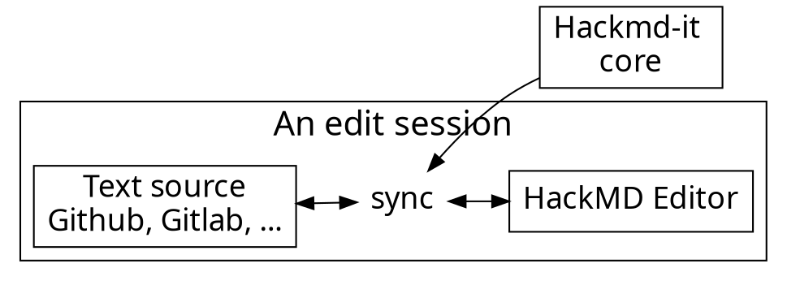

# Short introduction to Kanban

<!-- Put the link to this slide here so people can follow -->
slide: TODO

---

## What is Kanban?

- One of the pull systems
- Ideal to limit WIP
- kanban vs. kanban system vs. Kanban?

----

### Motivation
- Achieve a sustainable pace of work

----

### Customer trust

- Inrease customer (operation) trust <- Focus on quality <- Limit WIP increases quality
- Increase customer trust by frequent releases 

----

### Change resitance
- Introduce changes in the process with incremental approval 
- Reduces change resistance by focus on evolutive and incremental changes

----

### Transparency
- Kanban introduces transparency in work and in the work process
- Requires process policies to be explicitly defined
- Exposes bottlenecks and generate slack


---

## CTGENSOFT kanban system


---
## How to start?

- Visualize the work flow
- 
- Set meeting cadence: stand-up, replenishment, retrospective

---



---

### Usage flow

---




---

### Architecture of extension

---


---

## Content script

- Bind with each page
- Manipulate DOM
- Add event listeners
- Isolated JavaScript environment
  - It doesn't break things

---

# :fork_and_knife: 

---

<style>
code.blue {
  color: #337AB7 !important;
}
code.orange {
  color: #F7A004 !important;
}
</style>

- <code class="orange">onMessage('event')</code>: Register event listener
- <code class="blue">sendMessage('event')</code>: Trigger event

---

# :bulb: 

---

- Dead simple API
- Only cares about application logic

---

```typescript
import * as Channeru from 'channeru'

// setup channel in different page environment, once
const channel = Channeru.create()
```

---

```typescript
// in background script
const fakeLogin = async () => true

channel.answer('isLogin', async () => {
  return await fakeLogin()
})
```

<br>

```typescript
// in inject script
const isLogin = await channel.callBackground('isLogin')
console.log(isLogin) //-> true
```

---

# :100: :muscle: :tada:

---

### Wrap up

- Cross envornment commnication
- A small library to solve messaging pain
- TypeScript Rocks :tada: 

---

### Thank you! :sheep: 

You can find me on

- GitHub
- Twitter
- or email me
